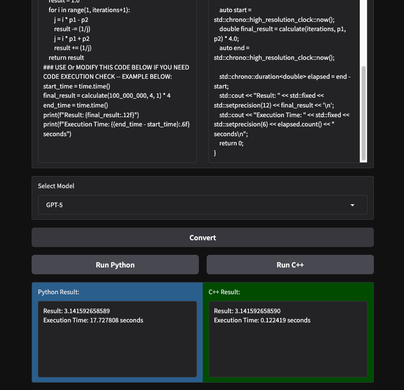
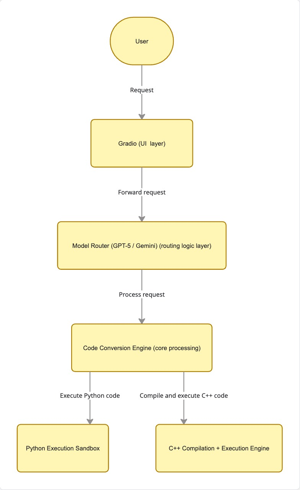

# About The App



## Description

- This app converts Python code to C++ code using GPT5 and Gemini.
- Code execution time can be checked and compared between the original Python code and the converted C++ code, so you can instantly see how optimized the converted code is.
- You can select the model you want to convert Python code into C++. Currently, GPT5 mini and Gemini flash 1.5 are available in the code. 

## Key Features
- Python → C++ code conversion using LLMs 
- Model selection between OpenAI GPT-5 Mini and Google Gemini 
- Real-time streaming of generated code
- Built-in execution environment for Python and compiled C++ 
- Automatic compilation with optimization flags (-O3, -ffast-math)
- Side-by-side output comparison

## Demo Video
https://drive.google.com/file/d/1TmJvlqpq0uH14oL2JINwTh9trgiiyOJo/view?usp=drive_link 

## Project Structure
llm-powered-python-to-cpp-code-converter/
│
├── run.py
│   Main application entry point. Handles environment setup, LLM calls,
│   streaming responses, code execution, and the Gradio UI.
│
├── placeholder_python_code.py
│   Contains example Python snippets used as default inputs in the UI.
│
├── css_elements.py
│   Custom CSS styles used to format the Gradio interface.
│
├── assets/
│   Contains diagrams and images used in the README documentation.
│
├── requirements.txt
│   Python dependencies required to run the project.
│
└── README.md
    Project documentation and usage instructions.

## Entry Point

Run the application with:

```bash
python app.py
```